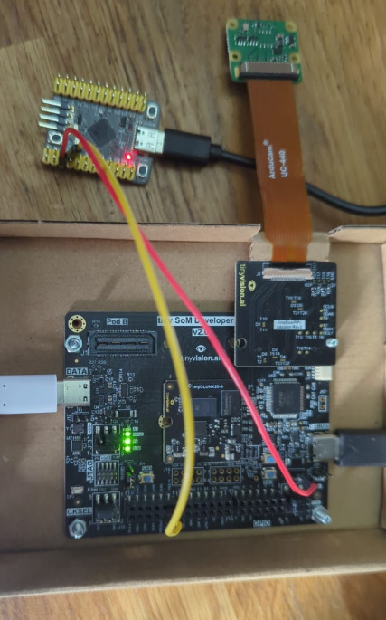

Running the Test Suite
######################

The test suite uses Zephyr's
`Twister <https://docs.zephyrproject.org/latest/develop/test/twister.html>`_
test tool for in-device testing.

This works by building a firmware that prints that prints the test results on the console,
which is read by the twister script to generate a report.

This permits testing many tests in an automated way.

This will be integrated into a Github CI environment to trigger tests from remote.

Customizing the build
=====================

You might need to adapt the test environment to your port numbers, baud rate, etc.

Most of this configuration is centralized in ``hardware-map.yml``, in which you can
add more boards or modify it to tune the parameters.

The ``Makefile`` that contains the build command can also be modified, or the
``west twister [...]`` command can also be run directly.

Finally, the ``scripts/ecpprog_hook_pre_cmd.sh`` and ``scripts/ecpprog_hook_post_cmd.sh``
will be run before and after the ``ecpprog`` command, which allows to run some custom script
to power cycle the board, and reset the board.

See ``scripts/do_power_cycle.sh`` and ``scripts/do_reset.sh`` for how to send custom commands
to a devboard over a shell for instance.

Pinout
======

In order to automatically reset the board, pins must be connected like below:

.. code-block::

   WeAct Studio STM32G431     tinyCLUNX33 Devkit Rev2
   _____________________       ______________________
                        |     |
                      A0+-----+EN
                      A1+-----+PROGn
   _____________________|     |______________________

any other board can be used instead of ``WeAct Studio STM32G431``, as long as it runs the
Zephyr shell on a serial port.
